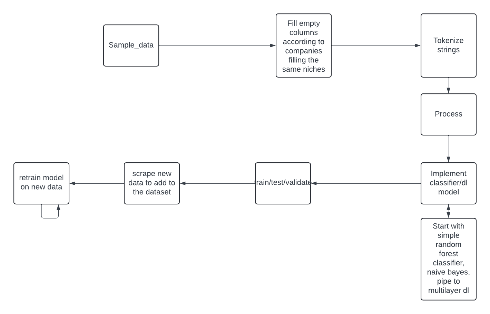

# Veridion-Challange

## Problem Chosen: Company Classifier

## Aproach
The first thing I did was scan the .csv file containing companies to see how noisy the data is, the distribution of different sectors, categories, etc.

The pipeline that I settled one does the following:
    1. Filter out noisy samples using a pretrained sentence transformer
    2. Assign pseudo-label (no ground truth) using the same trasnformer by computing the cosine similarity of the sample and labels vectorized
    3. Train a LSTM model on the labeled samples to be able to generalize the task in the future

The code as was run can be seen in notebooks/veridion2.ipynb.

The code was the split into different python files for modularization.

The model can be run passing a POST request to the server containing a .json body with company columns. A predicted tag will be sent back to the user.

Initial aproach: 
    
### Strenghts:
1. Effectivly comparing all the available company metadata
2. Rich label assignment, by filtering top-k labels
3. Modularity of aproach
4. Easily deployable using a FastAPI server as seen

### Weaknesess:
1. Lack of ground truth
2. Rare classes might be underrepresented and or misclassified - Fixable by augmenting the dataset to achieve a uniform distribution of company sectors
3. Dependency on preprocessing consistency

### Scalibility:
Because of the LSTM model being trained on the good sample, it may be retrained on good inputs.
The model may easily be modified - hyperparameters, architecture
    
## Alternatives Considered:
Simpler aproaches for filtering and assigning: TF-IDF
Simpler models: Random Forest, Naive Bayes
More complex neural architectures/pretrained sentence classifiers

## Trade-Offs:
Semantic loss of some samples, dropped by being below the threshold
Inblalance between some sectors causing the model to be slightly overfit

## What I Know I Don't Know
1. How good the chosen thresholds handle different domains
2. Robustness of filtering on diverse descrptions

## Future Improvements
1. Adaptive thresholding
2. Expert human-feedback ???? not really possible
3. Experimenting with different model architectures: GANs, pretrained classifiers, etc
4. Distributed inference and training 

## Leasons Learned:
1. Techniques for no ground truth or limited ground truth classification
2. Consistent preprocessing
3. Balancing scalability, compute power, time
    
